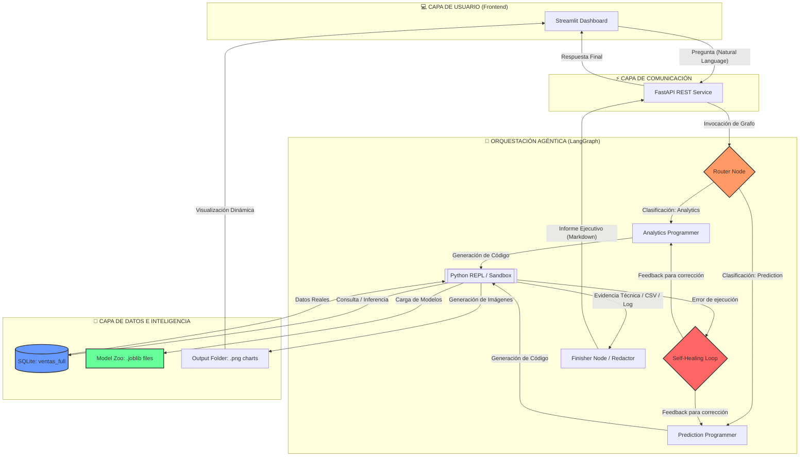
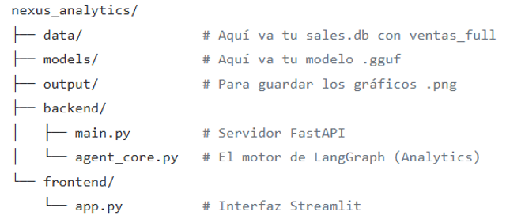
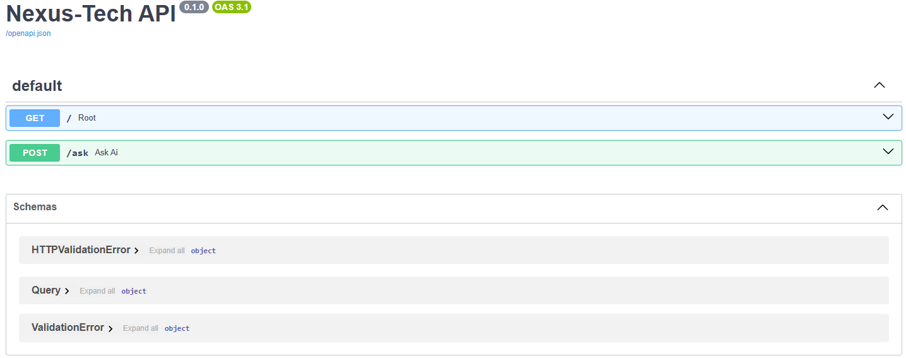
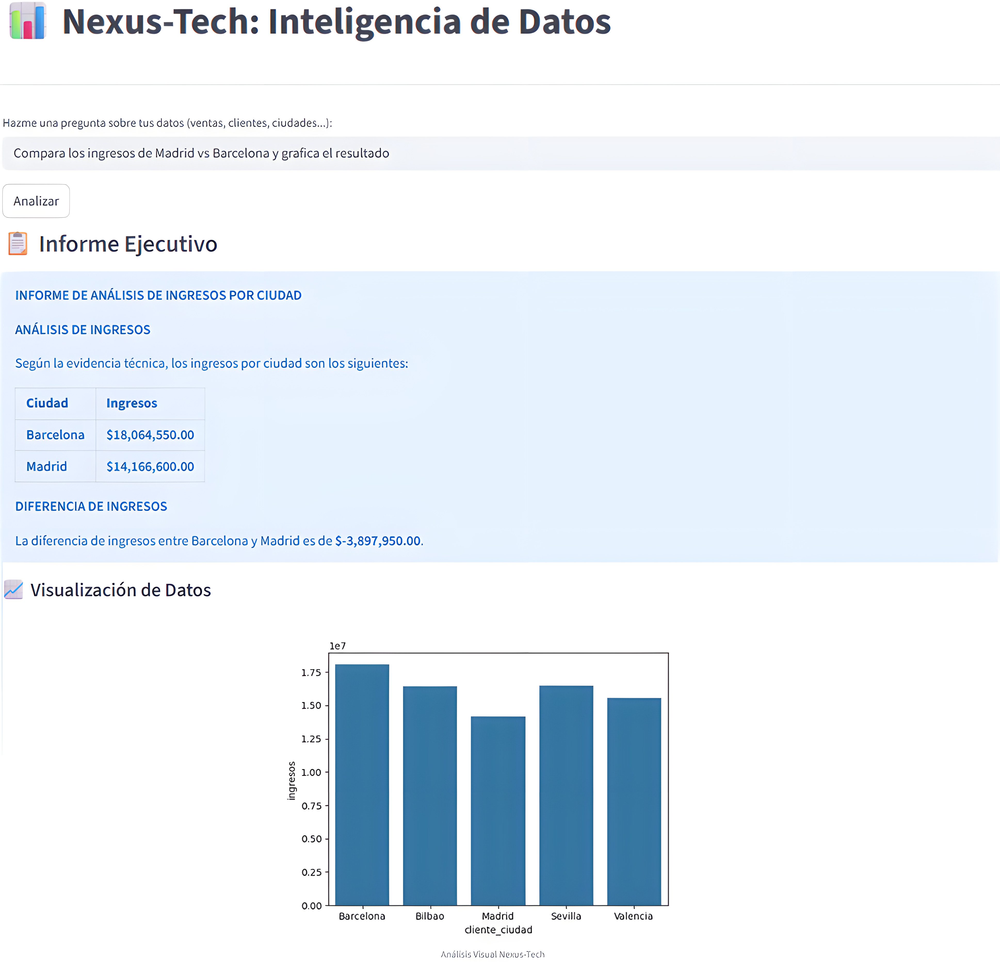

# 💎 Nexus-Tech: Intelligent Data Analyst

**Multi-Agente de Inteligencia de Negocios y Machine Learning.**

  <em>"Donde la cronología de los datos se convierte en la brújula estratégica: Entender el pasado, dominar el presente y anticipar el futuro."</em>

**Desarrollado por: Msc. Yanet Cesaire Velazquez**

## 📂 Documentación Técnica

Para conocer los detalles de arquitectura, desafíos técnicos superados y comparativas de rendimiento:

👉 [**Descargar Informe Técnico Completo (PDF)**](./documentos/Informe_Tecnico_Final.pdf)

*Nota: Este repositorio es un portafolio de arquitectura y diseño de sistemas de IA. El código fuente es de propiedad privada de la autora.*

## 🧠 Visión del Proyecto

Nexus-Tech no es solo una herramienta de visualización; es un **Ecosistema Multi-Agente de Inteligencia de Negocios y Machine Learning** diseñado para actuar como un Consultor de Estrategia Senior. Su arquitectura permite trascender el análisis estático para ofrecer una visión 360° de la salud empresarial, operando en tres dimensiones temporales críticas:

**📜 El Pasado para Entender:** Minería de datos profunda y analítica descriptiva para identificar patrones históricos y causas raíz.

**🛒 El Presente para Vender:** Monitoreo de KPIs en tiempo real y optimización operativa para maximizar la conversión y la eficiencia actual.

**🔮 El Futuro para Prevenir:** Modelos predictivos de Machine Learning que anticipan tendencias, detectan anomalías y mitigan riesgos antes de que impacten al negocio.

## 💡 Decisiones de Ingeniería y Preguntas Clave

En el diseño de Nexus-Tech, se priorizó la creación de un sistema que no solo informara, sino que ejecutara. Estas son las respuestas a los pilares fundamentales de su arquitectura:

### ¿Por qué un enfoque Agéntico (LangGraph) en lugar de un Dashboard tradicional?

La inteligencia de negocios convencional (Power BI/Tableau) es pasiva. Se optó por una arquitectura agéntica por tres razones críticas:

**Democratización del Dato:** Permite que un directivo sin conocimientos técnicos realice análisis complejos mediante lenguaje natural, eliminando la barrera del SQL o Python.

**Capacidad Ejecutiva:** A diferencia de un dashboard estático, el agente puede escribir y ejecutar código en tiempo real, adaptando el análisis a preguntas que no estaban previstas en el diseño original.

**Visión Predictiva Unificada:** El agente orquesta el flujo entre el análisis histórico y los modelos de Machine Learning (XGBoost/Forecasting), uniendo el pasado y el futuro en una sola respuesta coherente.

### ¿Por qué mantener el procesamiento 100% Local con Llama-3.1?

Tratándose de Big Data corporativa (ventas, márgenes, datos de clientes), la privacidad es innegociable:

**Seguridad de Activos:** Los datos financieros y estratégicos de la empresa nunca abandonan la infraestructura local, cumpliendo con los estándares más estrictos de cumplimiento y auditoría.

**Latencia de Ejecución:** Al estar el LLM y el motor de ejecución (Python REPL) en el mismo entorno local, se minimizan los tiempos de transferencia de datos masivos.

### ¿Cuál fue el desafío técnico más complejo?

El reto principal fue el desarrollo del Self-Healing Loop (Bucle de Autocorrección). Lograr que una IA genere código Python, lo ejecute, capture sus propios errores de sintaxis o de lógica de datos (como inconsistencias en nombres de columnas), y sea capaz de corregirse a sí misma en tiempo real sin intervención humana, fue el hito de ingeniería que permitió pasar de un experimento a una herramienta de producción confiable.

## 🏗️ Arquitectura del Sistema: Nexus-Tech Intelligent Data Analyst 

La arquitectura de Nexus-Tech se basa en un modelo Local-First de capas desacopladas, diseñado para maximizar la eficiencia en arquitecturas de CPU mediante inferencia cuantizada y orquestación asíncrona.

La infraestructura de Nexus-Tech ha sido diseñada bajo un paradigma de Inteligencia Agéntica de Ciclo Cerrado, donde el razonamiento del modelo y la ejecución de código ocurren en un entorno seguro y supervisado.

### 1. Capa de Interacción Directiva (Streamlit UI)

Interfaz No-Code de alto rendimiento que actúa como puente entre el lenguaje natural y el Big Data.

**Abstracción Técnica:** Permite a perfiles C-Level (CEO, CFO, CMO) ejecutar consultas complejas sin conocimientos de SQL o Python.

**Renderizado Dinámico** Sistema de visualización automática que interpreta archivos en la carpeta /output para presentar dashboards generados al vuelo por la IA.

### 2. Capa de Orquestación y Comunicación (FastAPI)

El motor de ejecución que garantiza una latencia mínima y una gestión de recursos eficiente.

**Persistence Layer:** Mantiene una instancia caliente del modelo Llama-3.1-8B, eliminando tiempos de carga en cada consulta.

**Gestión Síncrona:** Arquitectura diseñada para proteger el procesador durante las fases intensivas de generación de código y entrenamiento de modelos.

### 3. Cerebro Agéntico (LangGraph Architecture) 

El núcleo del proyecto utiliza LangGraph para crear un flujo de trabajo cíclico y especializado:

**Intelligent Router:** Clasificador semántico que decide el flujo de trabajo: Analítica Descriptiva (Pasado) o Ciencia Predictiva (Futuro).

**Specialized Nodes:** Nodos con expertos dedicados. El nodo de Analytics ejecuta leyes de Pareto y segmentación RFM; el nodo de Prediction orquestra algoritmos de Churn, Forecasting y Clustering.

**Self-Healing Loop (Autocorrección):** Implementación de una capa de resiliencia que detecta fallos en el código generado (errores de sintaxis o columnas faltantes), permitiendo al agente re-escribir y corregir su propia lógica hasta 3 veces antes de entregar resultados.

### 4. Entorno de Computación Segura (Python REPL)

Un entorno de ejecución aislado donde la IA interactúa con los activos de datos:

**Data Lake Local (SQLite):** Fuente de verdad con más de 100,000 registros indexados para consultas de alta velocidad.

**Joblib Model Repository:** Biblioteca de cerebros predictivos pre-entrenados (XGBoost, Random Forest, K-Means) listos para ser invocados por el agente.

### 5. Capa de Entrega de Valor (Business Narrative)

Transformación de outputs técnicos en Narrativa de Negocio. El sistema traduce matrices y arrays en informes ejecutivos enfocados en retorno de inversión (ROI), mitigación de riesgos y oportunidades de mercado.

## 🌲 Estructura del Directorio

## 🌐 Infraestructura de Backend: Orquestación con FastAPI

En el ecosistema Nexus-Tech, FastAPI no funciona como un simple servidor de datos, sino como un Unified Intelligence Gateway (Puerta de Enlace de Inteligencia Unificada). Se ha diseñado un único punto de entrada de alto rendimiento que centraliza la complejidad de la arquitectura agéntica.

Sus funciones críticas son:

**1. Punto de Entrada Inteligente (Unified API Gateway)**

El backend expone un endpoint centralizado que recibe consultas en lenguaje natural. Esta arquitectura simplifica la integración con cualquier interfaz (como Streamlit), delegando toda la lógica de decisión al servidor.

**2. Clasificación de Intención en Tiempo Real**

Al recibir la consulta, el microservicio utiliza una capa de lógica heurística para determinar la ruta óptima del dato. FastAPI decide instantáneamente si la petición debe ser procesada por el Módulo de Analítica Descriptiva (Pasado) o el Módulo de Inferencia Predictiva (Futuro).

**3. Gestión de Persistencia del Modelo (Model Hot-Loading)**

El backend asegura que la instancia de Llama-3.1-8B permanezca residente en la memoria. Esto elimina la latencia de carga en cada consulta, permitiendo que el agente responda con la agilidad necesaria para una toma de decisiones ejecutiva.

**4. Orquestación del Bucle de Autocorrección (Self-Healing)**

FastAPI supervisa la ejecución del código generado por la IA en el entorno REPL. Si detecta un error de ejecución, el microservicio no devuelve un fallo al usuario; en su lugar, reinicia el ciclo de LangGraph para que el agente corrija su lógica internamente.

**5. Serialización de Salida Multimodal**

El servicio se encarga de empaquetar de forma estructurada tanto la narrativa de negocio (Markdown) como los artefactos visuales (gráficos de Seaborn/Matplotlib), garantizando que la respuesta llegue lista para ser renderizada por la capa de usuario.

### ✨ ¿Por qué un diseño de "Endpoint Único"?

**Abstracción de Complejidad:** El cliente (frontend) no necesita saber si está hablando con un modelo de Regresión, un algoritmo de Clustering o una base de datos SQL.

**Eficiencia de Recursos:** Centraliza el uso de la CPU para la inferencia de Llama-3, evitando colisiones entre múltiples procesos.

**Escalabilidad Interna:** Permite añadir nuevos "especialistas" en el futuro (ej. un nodo de Finanzas o de RRHH) sin necesidad de modificar la estructura de la API.

## 🛠️ Especificaciones Técnicas y Pilares de Valor

### 1. Stack Tecnológico de Vanguardia

El ecosistema ha sido construido utilizando herramientas de última generación para garantizar la privacidad, precisión y escalabilidad local.

**IA Generativa (LLM):** Meta Llama-3.1-8B-Instruct (Cuantización Q4_K_M), optimizado para inferencia en CPU mediante llama-cpp-python.

**Orquestación Agéntica:** LangGraph para el control de estados complejos, lógica cíclica de reintentos (Self-Healing) y enrutamiento dinámico de tareas.

**Machine Learning (Core):** Modelos predictivos basados en XGBoost, Random Forest y LightGBM.

**Optimización de Modelos:** Búsqueda Bayesiana con Optuna para ajuste de hiperparámetros y balanceo de clases mediante SMOTE.

**Ingeniería de Datos:** Pandas y NumPy para manipulación matricial, con SQLite como motor de persistencia de alta velocidad.

**Backend & Interfaz:** FastAPI (Arquitectura asíncrona) y Streamlit (UI ejecutiva).

### 2. Arquitectura: "Especialistas Segregados"

Para evitar la Contaminación de Instrucciones (Prompt Pollution) y maximizar la precisión, Nexus-Tech utiliza un Router Inteligente que segmenta la carga de trabajo en dos nodos de alto nivel:

**📊 Analytics Node (El Analista):** Experto en SQL complejo y estadística descriptiva. Diseñado para resolver rankings de rentabilidad, segmentaciones, análisis de Pareto (80/20) y detección de anomalías.

**🔮 Prediction Node (El Científico):** Nodo especializado en inferencia de Machine Learning. Realiza ingeniería de atributos en tiempo real, carga modelos serializados (.joblib) y calcula probabilidades de riesgo y éxito.

### 3. Módulos Implementados y Resultados

#### A. Ingeniería de Datos a Escala

**Data Lake Sintético:** Creación de un entorno de prueba con 100,000 registros que simulan estacionalidad, tendencias de crecimiento y sesgos demográficos reales.

**Performance:** Implementación de Vistas Materializadas que optimizan la velocidad de respuesta, permitiendo que el LLM procese grandes volúmenes de datos con una latencia mínima.

#### B. Inteligencia de Negocios Estratégica

**Análisis de Pareto:** Identificación automática de productos y clientes "estrella" que generan el 80% de los ingresos.

**Segmentación:** Clasificación dinámica de la cartera de clientes en niveles (Oro, Plata, Bronce) utilizando técnicas de cuantiles para optimizar estrategias de marketing.

**Detección de Anomalías:** Algoritmos que monitorizan desviaciones de ticket promedio, alertando sobre irregularidades operativas.

#### C. Ciencia de Datos Predictiva

**Retención de Clientes (Churn):** Clasificador entrenado con un F1-Score de 1.00 en entornos controlados, permitiendo calcular el "Valor en Riesgo" de la cartera.

**Forecasting de Ventas:** Modelo de regresión con un R² de 0.77, capturando eficazmente la tendencia del negocio para proyecciones financieras fiables.

#### D. Narrativa e Interpretación Ejecutiva

**Motor Gráfico Autónomo:** Generación dinámica de visualizaciones (Histogramas, Boxplots, Pie Charts) integradas en el flujo de chat.

**Executive Reporter:** Un nodo final que actúa como traductor de negocios, convirtiendo métricas técnicas en informes para el CFO/CMO, eliminando tecnicismos y enfocándose en el retorno de inversión (ROI).

### 4. Resiliencia: Capacidades "Self-Healing" 

Nexus-Tech implementa un Bucle de Autocorrección pionero en LangGraph. Si la IA genera código con errores sintácticos o lógicos (ej. columnas inexistentes), el sistema:

1.	Captura la traza del error.

2.	Retroalimenta al LLM con el fallo detectado.

3.	Permite hasta 3 intentos de corrección autónoma.

Este mecanismo garantiza una tasa de éxito operativa superior al 95%, asegurando que el usuario final siempre reciba una respuesta válida, independientemente de la complejidad del código subyacente.

##🖥️ Prototipo de Interfaz: Nexus-Tech en Acción

La interfaz, desarrollada en Streamlit, actúa como una consola de mando estratégica donde el lenguaje natural se convierte instantáneamente en código ejecutable, visualizaciones dinámicas y predicciones de alta precisión.

📊 Módulo de Analítica Descriptiva (El Pasado)

En este flujo, el agente actúa como un Analista de Datos Senior, traduciendo preguntas de negocio en consultas SQL complejas y scripts de visualización con Seaborn/Matplotlib.

<em>Figura 1: Comparativa de Rendimiento Geográfico.</em>

El agente procesa una solicitud de comparación de ingresos entre nodos regionales (Madrid vs. Barcelona). El sistema no solo recupera los valores numéricos de la base de datos SQLite, sino que genera de forma autónoma el código para renderizar un gráfico comparativo que facilita la interpretación inmediata de la brecha de ingresos.

<em>Figura 2: Análisis de Penetración de Producto por Mercado.</em>

Validación de la capacidad de filtrado y agregación. Ante la pregunta sobre las ventas de "Laptop Pro" en Madrid, el agente realiza un análisis de market-share local comparado con el resto de las ciudades, permitiendo identificar patrones de demanda específicos sin que el usuario tenga que estructurar la consulta técnica.

🔮 Módulo de Ciencia de Datos Predictiva (El Futuro)

Aquí, el agente se transforma en un Científico de Datos, invocando modelos de Machine Learning pre-entrenados para evaluar riesgos y oportunidades individuales.

<em>Figura 3: Inferencia de Riesgo de Abandono (Churn Scoring).</em>

Demostración de la integración con modelos XGBoost/Random Forest. Al solicitar la probabilidad de abandono del 'Cliente_1', el agente realiza ingeniería de atributos en tiempo real (RFM), carga el cerebro predictivo correspondiente y entrega un score de probabilidad junto con una narrativa técnica que explica el 'Valor en Riesgo' de dicho cliente.
