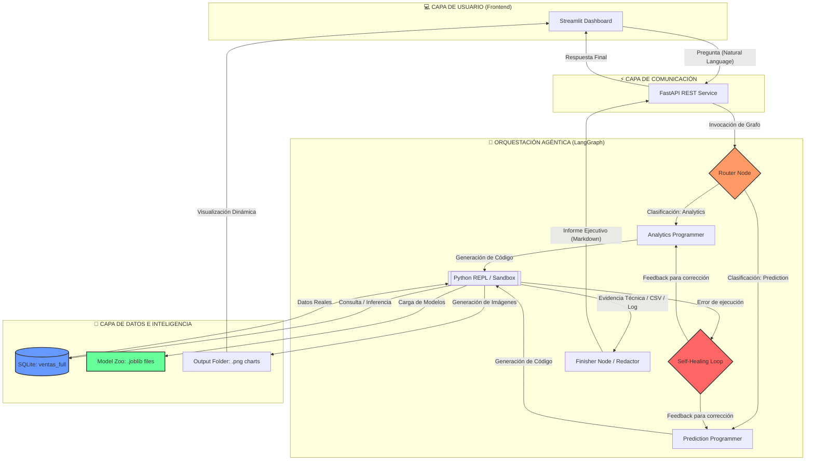

# 💎 Nexus-Tech: Intelligent Data Analyst

**Agente Multi-Agente de Inteligencia de Negocios y Machine Learning.**

  <em>"Donde la cronología de los datos se convierte en la brújula estratégica: Entender el pasado, dominar el presente y anticipar el futuro."</em>

**Desarrollado por: Msc. Yanet Cesaire Velazquez**

## 📂 Documentación Técnica

Para conocer los detalles de arquitectura, desafíos técnicos superados y comparativas de rendimiento:

👉 [**Descargar Informe Técnico Completo (PDF)**](./documentos/Informe_Tecnico_Final.pdf)

*Nota: Este repositorio es un portafolio de arquitectura y diseño de sistemas de IA. El código fuente es de propiedad privada de la autora.*

## 🧠 Visión del Proyecto

Nexus-Tech no es solo una herramienta de visualización; es un **Ecosistema Multi-Agente de Inteligencia de Negocios y Machine Learning** diseñado para actuar como un Consultor de Estrategia Senior. Su arquitectura permite trascender el análisis estático para ofrecer una visión 360° de la salud empresarial, operando en tres dimensiones temporales críticas:

**📜 El Pasado para Entender:** Minería de datos profunda y analítica descriptiva para identificar patrones históricos y causas raíz.

**🛒 El Presente para Vender:** Monitoreo de KPIs en tiempo real y optimización operativa para maximizar la conversión y la eficiencia actual.

**🔮 El Futuro para Prevenir:** Modelos predictivos de Machine Learning que anticipan tendencias, detectan anomalías y mitigan riesgos antes de que impacten al negocio.

## 🏗️ Arquitectura del Sistema: Nexus-Tech Intelligent Data Analyst 

